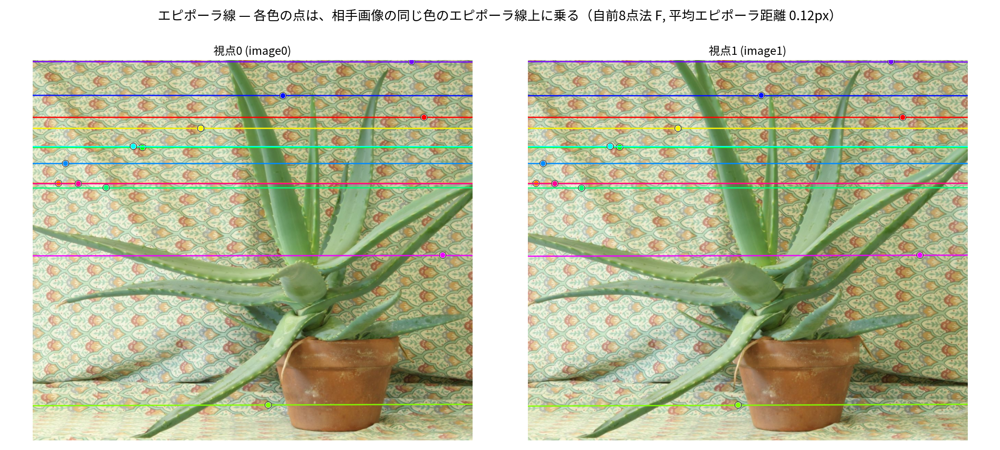

# Fundamental Matrix — 基礎行列の推定とエピポーラ線の描画

同一シーンを別視点から撮った **2 枚の画像** から **基礎行列 F** を推定し、
エピポーラ幾何を可視化する汎用ツール。SIFT で対応点を求め、RANSAC + 正規化 8 点法で
F を推定し、左右の画像にエピポーラ線を描いて対応関係を確認できる。

このツールがやること:

1. 同一シーンを別視点から撮った **2 枚の画像** を入力する
2. **基礎行列 F** を推定する（正規化 8 点法 + RANSAC）
3. **エピポーラ線** を描画する
4. 対応点が対応するエピポーラ線上に乗ることを **定量・目視で確認** する

## セットアップ

依存と Python (3.12) は [uv](https://docs.astral.sh/uv/) で管理する。

```bash
uv sync
```

`.venv` が作られ、`uv.lock` で固定されたバージョンの依存がインストールされる。

## 使い方

```bash
# サンプル (Aloe ステレオペア) で実行
uv run python fundamental_matrix.py

# 自分で撮った 2 枚の写真で実行（data/user/ に置いてパスを指定）
uv run python fundamental_matrix.py --img0 data/user/left.jpg --img1 data/user/right.jpg
```

主なオプション:

| オプション | 既定値 | 説明 |
|---|---|---|
| `--img0`, `--img1` | `data/aloeL.jpg`, `data/aloeR.jpg` | 入力 2 画像 |
| `--out` | `outputs` | 出力ディレクトリ |
| `--ratio` | `0.75` | Lowe ratio test の閾値（小さいほど厳しい）|
| `--max-side` | `1200` | 入力画像の長辺上限 [px]（大きい写真は自動縮小）|
| `--num-epilines` | `12` | 描画するエピポーラ線の本数 |

### 自分で撮る場合のコツ
- 同じシーンを、横に少し移動して 2 枚撮る（並進ベースライン）。
- テクスチャ（模様・凹凸）が豊富だと特徴点マッチが増えて安定する。
- 対応点が 8 組以上必要。少なすぎる場合は `--ratio 0.8` 程度に緩める。
- 自分の写真は `data/user/` に置く（中身は git 管理外。サンプルの `data/aloe*.jpg` は追跡される）。

## 手法

`fundamental_matrix.py` のパイプライン:

1. **特徴点と対応** — SIFT で特徴点・記述子を抽出し、FLANN による KNN(k=2) +
   Lowe の ratio test で対応点を得る。
2. **F の推定** — `cv2.findFundamentalMat`（MAGSAC）で外れ値を除去（RANSAC）し、
   inlier に対して **正規化 8 点法を自前実装**（`eight_point`）して F を求める。
   - Hartley 正規化（重心を原点、平均距離 √2）→ SVD で線形最小二乗解
     → rank-2 強制（det F = 0）→ 正規化を戻す。
   - 8 点法の線形方程式をそのまま over-determined な系として解いている。
3. **エピポーラ線の描画** — `cv2.computeCorrespondEpilines` で、片方の画像の点に
   対応するエピポーラ線をもう片方の画像に描く。点と線を同じ色で対応付ける。
4. **検証** — inlier の **平均対称エピポーラ距離 [px]** を表示し、
   自前 F と OpenCV の F を（スケール・符号を揃えて）比較する。

> 規約: 本コードは `pts1ᵀ F pts0 = 0` を満たす F を用いる（OpenCV と同じ）。
> 別表記の `x0ᵀ F' x1 = 0` は `F' = Fᵀ` で同じ行列を指す（左右の取り方の違い）。

## 出力

`outputs/` に以下が生成される:

- `matches.png` — RANSAC inlier の特徴点マッチ
- `epilines.png` — 左右の画像に色分けした点とエピポーラ線。各色の点が相手画像の
  **同色の線上に乗る** ことを目視確認できる
- `results.txt` — F 行列・マッチ数・inlier 数・平均エピポーラ距離のサマリ

## 結果（サンプル Aloe ペア）

| 指標 | 値 |
|---|---|
| SIFT 対応点（ratio test 後） | 7490 組 |
| RANSAC inlier | 6575 組 |
| 平均対称エピポーラ距離（自前 8 点法） | **0.119 px** |
| 平均対称エピポーラ距離（OpenCV） | 0.119 px |
| 自前 F と OpenCV F の差（正規化後 Frobenius） | 0.031 |

対応点はサブピクセル精度（約 0.12 px）でエピポーラ線上に乗っており、自前実装の 8 点法と
OpenCV の結果はほぼ一致する。


